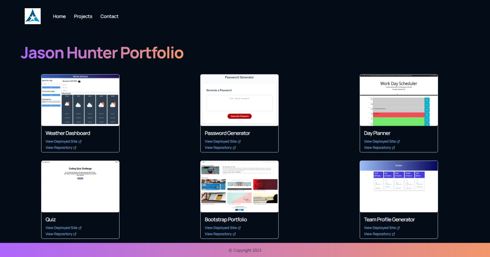

# React-Portfolio
An updated version of the original portfolios, created using React 18. 

  ## Description
  A React Portfolio that uses routing to navigate pages to present a single page application. Incorporates a Header component that is appears on the main container pages, the Header has a sub component of a Navigation Bar which uses React Routing to navigate around the site. The portfolio of projects is again a component which reads details about the projects from a json file and then displays them as individual cards within the Projrcts container. To ensure that accces to my CV was validated, I used Firebase to sent a authentication email to the requester, once the requester has validated their email address the button changes from 'Request' the 'Download and the requester can download the pdf.

  

## Table of Contents 

* [Installation](#installation) 

* [Usage](#usage) 

* [Contributors](#contributors) 

* [Tests](#tests) 

* [Questions](#questions) 

* [License](#license)

* [Screenshot](#screenhot)
 

## Installation 

To install this app follow the steps below: 

  1. Git Clone [repo] - To Clone Repository.
  2. Npm Install - To Download Dependencies.

## Usage 

Follow the steps below to use this app: 

  *  Npm Start -Runs the app in the development mode. Open [http://localhost:3000](http://localhost:3000) to view it in your browser.

## Contributors 

Contributions are what make the open source community such an amazing place to learn, inspire, and create. Any contributions you make are greatly appreciated. 

Current contributors are: 

  Computastar

## Tests

To run test type the following command/s: 

  The test were pre created using Jest. The package.jsaon is update to run these scripts by running:
  
  None

## Site
GitHub Public Repo

https://github.com/Computastar/React-Portfolio

GitHub Page Link

https://computastar.github.io/React-Portfolio/

## Questions

Any question, get intouch: 

  Github: [Computastar](https://github.com/Computastar)

 
## License

  MIT License

  Distributed under the MIT License See LICENSE.txt for more information
  
## Screenshot

